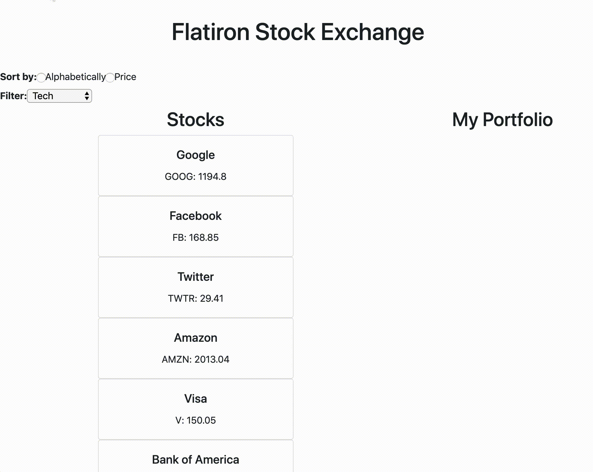

## Flatiron Stock Exchange

This project was converted from react to vue for problem solving.


For getting the CSS for the col/row to work.

https://blog.logrocket.com/getting-started-with-bootstrapvue-2d8bf907ef11/

The process I went through to get the row/colunms to work was:

*npm install bootstrap-vue bootstrap axios

*added code to the <head> in the index.html file

*Added code to the main.js

*this then caused the basic row/column to work in the MainContainer.


*From the guide I didn't use the script tags since it was breaking the code.

<!-- Add Vue and BootstrapVue scripts just before the closing </body> tag -->

<script src="https://unpkg.com/vue/dist/vue.min.js"></script>

<script src="https://unpkg.com/bootstrap-vue@latest/dist/bootstrap-vue.min.js"></script>




Welcome to the Flatiron Stock Exchange!
Today, you are a broker who is trying to better organize the stocks available on the Flatiron Stock Market.
The database of stocks can be found in a JSON-server, so before you start your React server, make sure to start your JSON-server on `http://localhost:3000/stocks`.

```
TO INSTALL: npm install -g json-server
TO START: json-server --watch db.json

TO START Vue server: npm run serve
```

After the stocks are fetched, your job is to:
* Render all the stocks onto the page. The styling of how a Stock should look like is already in the `Stock.js` component.
* allow a user to buy a stock by clicking on it and when it is bought, it should be added to `My Portfolio`.
* allow a user to sell a stock in their `Portfolio` by clicking on the stock and it should be removed from their `Portfolio`.
* allow a user to sort the list of stocks alphabetically by the ticker name as well as by ascending price.
* allow a user to filter stocks based on the type of the stock.

Best of luck!
